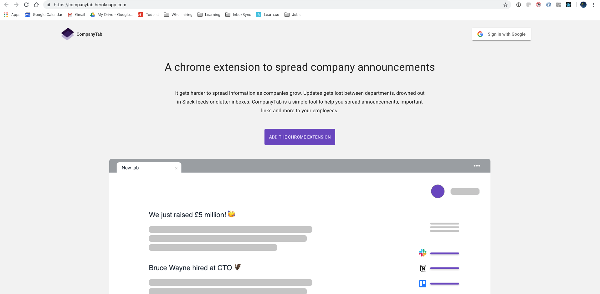
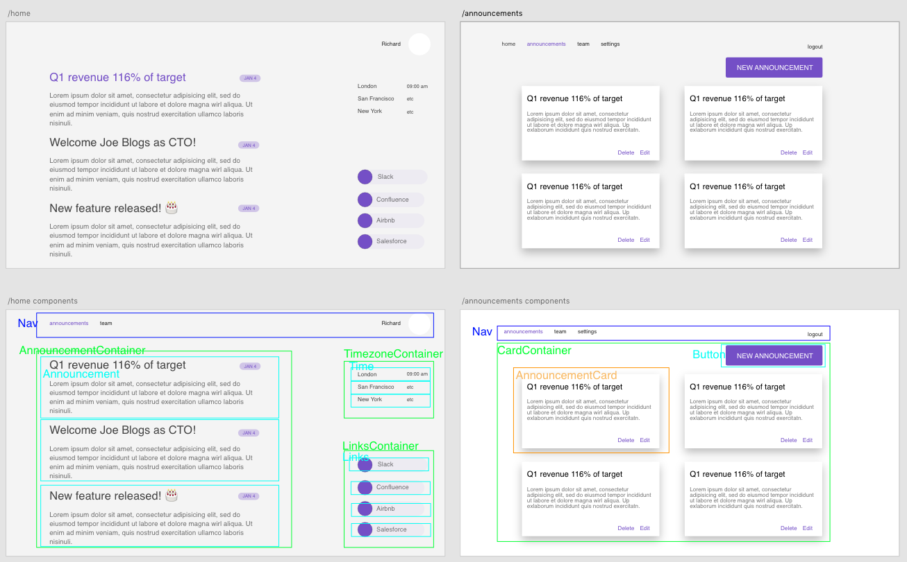
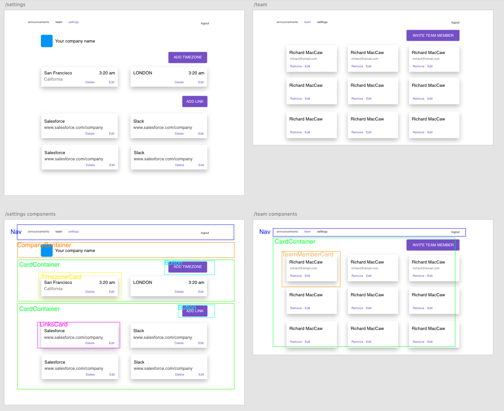
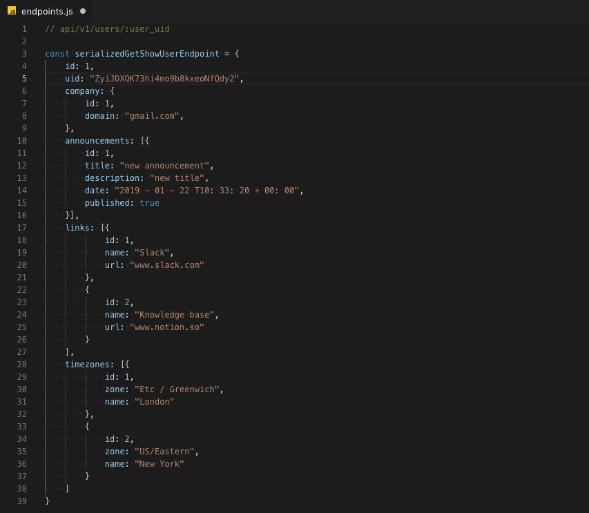
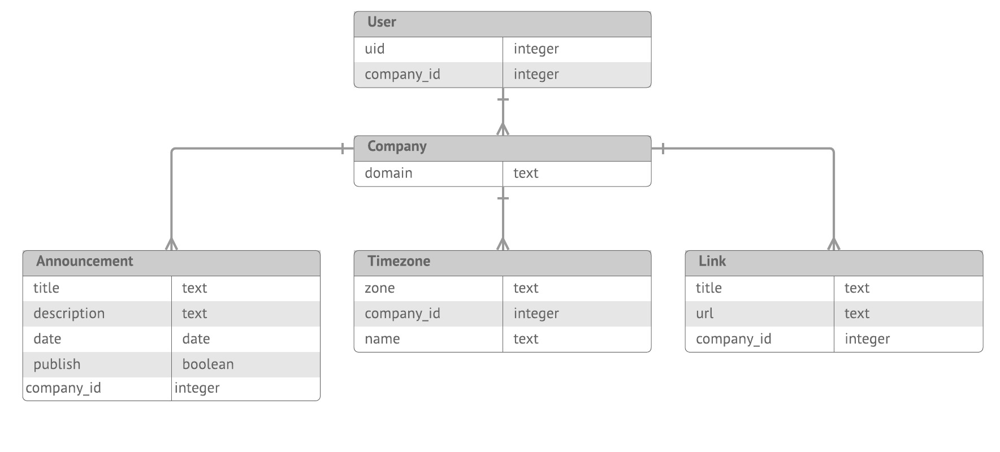

## CompanyTab

CompanyTab makes it simple to spread information to your employees. It's a chrome extension and web app that shows company announcements, quick links and timezones. Once you've installed the chrome extension and logged in with your work gmail address, every new tab will show important company information. A new company will start without any announcements, so the new tab will be blank. Log into to the [webapp](https://companytab.herokuapp.com/) first, create an announcement and then see it propogate across all your employees new tabs.

You can see a live demo [here](https://companytab.herokuapp.com/)

#### Problem
As companies grow in size, it becomes increasingly difficult to spread information around. Announcments disappear in Slack feeds or in email inboxes. Employees get more disconnected. 

#### Solution
CompanyTab is a simple tool to take over your employees new tab page and highlight the latest company announcements.

#### Tech
* React frontend, Material-ui for styling, Firebase and Google OAuth for authentication, Ruby on Rails backend.

#### User Story
As an employee I want to...
* Read the most important company information in an unobtrusive, quick and simple way.
* Have access to links to useful company information.
* See the local timezones across our companies offices.

As an employer I want to...
* Have full control to create, edit, delete and unpublish announcements
* Have the announcements I make immediatly available to employees via their new tab.
* CRUD timezones and company links
* Make sure that no other companies have access to my companies announcements.

## Wireframes and component planning

## Database and endpoint planning

