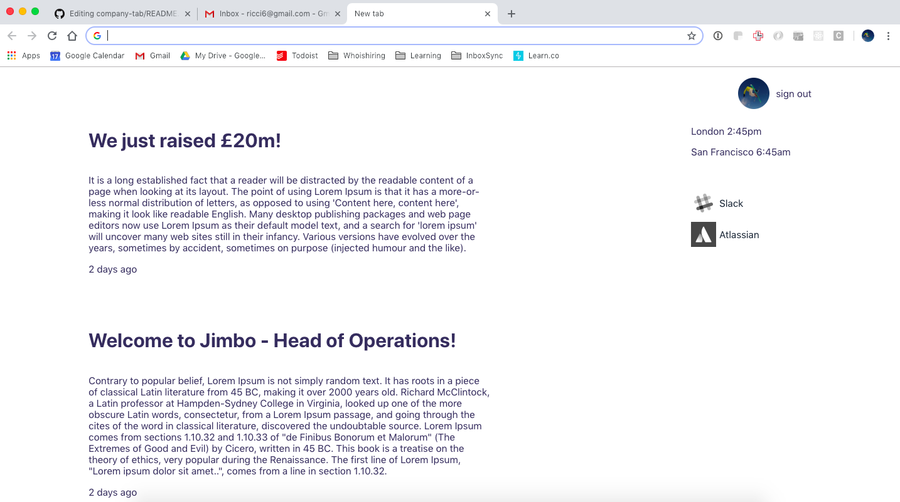
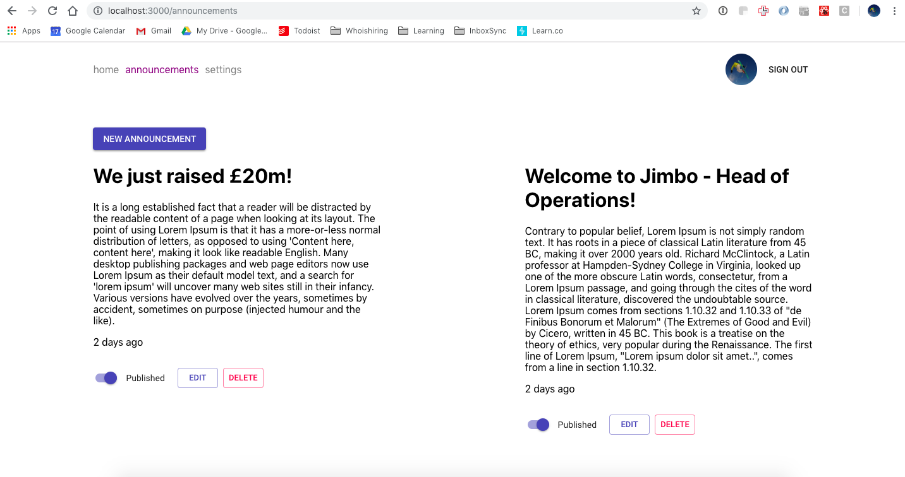
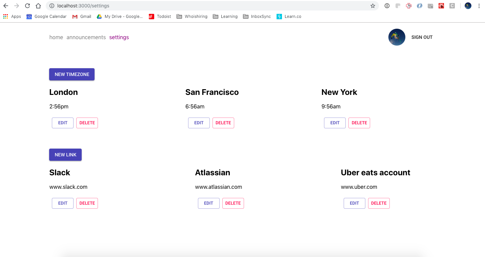

## CompanyTab
(in progress)

CompanyTab makes it simple to spread information to your employees. It's a chrome extension and web app that shows company announcements, quick links and timezones. Once you've installed the chrome extension and logged in with your work gmail address, every new tab will show important company information.

#### Problem
As companies grow in size, it becomes increasingly difficult to spread information around. Did all of HR know a new feature was released? Were the sales team aware of a new marketing product video? Did you just hire a lead developer? Information can quickly fall between the gaps in departments. CompanyTab takes over your employees new tab page to highlight the latest company announcements and more.

### Screenshots
New tab page

Edit announcements page

Edit links and timezones page

#### Tech
* React frontend
* Material-ui for styling
* Firebase and Google OAuth for authentication
* Ruby on Rails backend
